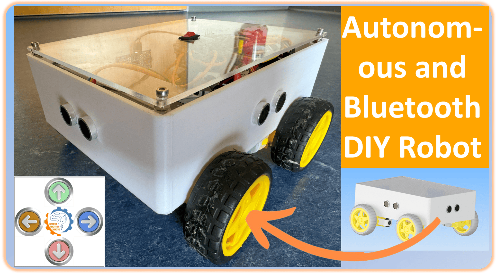

# Arduino_Bluetooth_Autonomous_Car

This project demonstrates how to build an advanced robot car capable of autonomous navigation and Bluetooth control. The car is built using Arduino Mega, HC-05 Bluetooth module, multiple ultrasonic sensors, and the Adafruit Motor Shield. It combines mechanical design, Arduino programming, and app development to create a versatile and interactive robot.

## Features
- Autonomous navigation using ultrasonic sensors (front, back, left, right)
- Bluetooth-controlled movements via a custom Android app
- Modular design with a 3D-printed chassis, motor mounts, and Arduino holder
- Powered by four DC motors controlled via Adafruit Motor Shield

## Components
- Arduino Mega
- Adafruit Motor Shield
- HC-05 Bluetooth Module
- 4 Ultrasonic Sensors (HC-SR04)
- 4 DC Motors with Gearboxes
- Plexiglas chassis and 3D-printed mounts
- Battery pack for power supply
- Android app for Bluetooth control

## App Information
The app, `BluetoothCarControl_SP.apk`, is developed using MIT App Inventor and is compatible with Android devices. It enables manual control and toggling between manual and autonomous modes. The source file `BluetoothCarControl_SP.aia` is included for customization.

## Resources
- **Blog:** [Advanced Autonomous and Bluetooth-Controlled Car](https://omartronics.com/building-an-advanced-autonomous-and-remote-controlled-robot-car-with-arduino-mega-ultrasonic-sensors-and-adafruit-motor-shield/)
- **Youtube:** [Advanced Autonomous and Bluetooth-Controlled Car](https://youtu.be/Q5qgsgQIZOw?si=uoOh5d__6ADlRHmj)
- **STL Files:** [Advanced Autonomous and Bluetooth-Controlled Car](https://cults3d.com/:2336371)
- **Arduino Code:** Available in this repository
- **App Files:** `BluetoothCarControl_SP.apk` and `BluetoothCarControl_SP.aia`

## Quick Start
1. **Assemble the robot chassis:** Follow the step-by-step guide in the blog.
2. **Program the Arduino:** Upload the provided Arduino code for Bluetooth and autonomous functionality.
3. **Install the App:** Install the Android app on your smartphone and pair it with the HC-05 module.
4. **Control the robot:** Use the app to control the car manually or enable autonomous navigation.

## License
This project is open-source and available for educational purposes. Feel free to modify and expand it.
